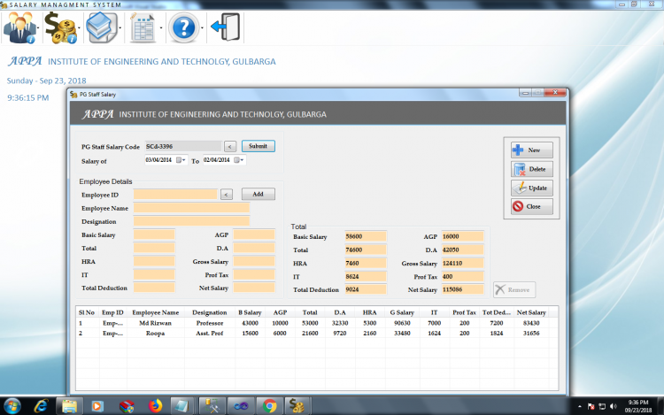

# Salary Management System using VB.NET and MS SQL Server

### Description

This project is based on the concept of the account. This project is a Salary Management System which is a Database system that can be used for managing employee Salary Details. It is a multi-user system and can be used by hundreds of users at the same time.

### Features

<ul>
  <li><strong>Managing Information on Employees</strong></li>
  <li><strong>Employees Salary Details</strong></li>
  <li><strong>Result Processing</strong></li>
  <li><strong>Reports</strong></li>
</ul>

Visit [sourcecodester.com](https://www.sourcecodester.com/visual-basic-net/12686/salary-management-system.html) for more detailed information about this Project.

### Website Info

| Title | Salary Management System using VB.NET and MS SQL Server with Source Code |
|:--|:--|
| Website | [www.sourcecodester.com](https://www.sourcecodester.com) |
| Link | https://www.sourcecodester.com/visual-basic-net/12686/salary-management-system.html |
| Language | VB.NET |
| Uploader/Developer | [Hasan soherwardi](https://www.sourcecodester.com/users/hasan-soherwardi) |
